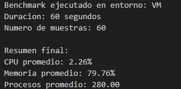
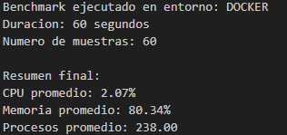
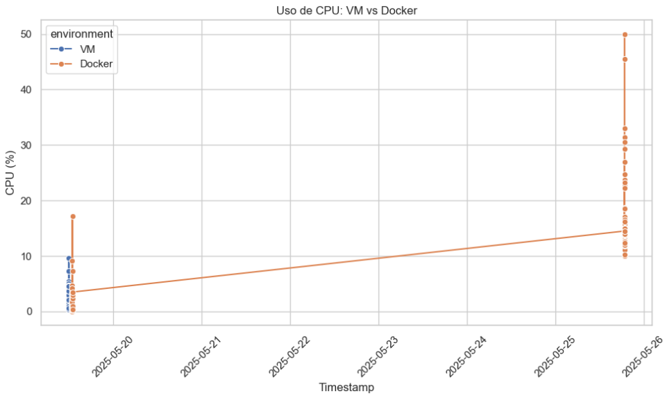
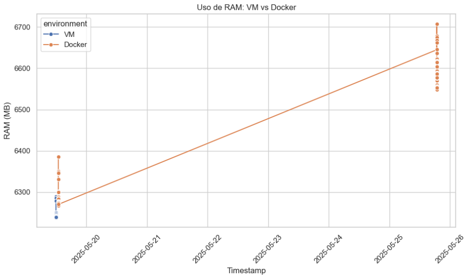

# VM vs Docker Benchmark

Este proyecto compara el rendimiento de una aplicación ejecutándose en una Máquina Virtual (VM) vs Docker. Utiliza un servidor Flask y realiza benchmarks de CPU, RAM y latencia durante 60 segundos. Los resultados se guardan en archivos CSV y TXT, y se visualizan con un Jupyter Notebook.

## 🧱 Máquinas Virtuales vs Contenedores Docker
¿Qué es una Máquina Virtual (VM)?
Una máquina virtual es una emulación completa de un sistema operativo que se ejecuta sobre otro sistema operativo anfitrión, usando un hipervisor (como VirtualBox o VMware). Cada VM tiene su propio kernel, memoria, disco y red virtualizados.

### ✅ Ventajas:
- Aislamiento total del sistema huésped.

- Permiten ejecutar diferentes sistemas operativos.

- Muy útil para simular entornos de producción.

### ❌ Desventajas:
- Requieren más recursos (RAM, CPU, almacenamiento).

- Más lentas para iniciar y ejecutar procesos.

- Administración más pesada comparado con contenedores.

## ¿Qué es un Contenedor Docker?
Un contenedor Docker es una unidad ligera y portable que empaqueta una aplicación y todas sus dependencias, ejecutándose sobre el kernel del sistema anfitrión. A diferencia de las VMs, los contenedores no requieren un sistema operativo completo, solo lo necesario para que la aplicación funcione.

### ✅ Ventajas:
- Muy ligeros y rápidos de iniciar.

- Aislamiento eficiente de aplicaciones.

- Fácil despliegue y escalabilidad.

- Uso eficiente de recursos del sistema.

### ❌ Desventajas:
- Aislamiento menor comparado con VMs (usan el mismo kernel del host).

- Dependencia del sistema operativo base.

- Puede ser más complejo asegurar ciertos entornos si se mezclan contenedores mal diseñados.

## 🕹️ Relación con el Proyecto (Tetris + Benchmarking)
Este proyecto consiste en un servidor de Tetris implementado con HTML, JavaScript y Python, que incluye un sistema de benchmarking automatizado para comparar el rendimiento al ejecutarlo en diferentes entornos.

### ¿Por qué usar VM y Docker?
El objetivo es comparar cómo se comporta el servidor de Tetris en una máquina virtual frente a un contenedor Docker en términos de:

- Tiempo de respuesta.

- Uso de recursos.

- Estabilidad bajo carga.

- Benchmarking en contexto:

El archivo benchmark.py ejecuta pruebas de carga durante un minuto mientras el servidor corre, y guarda los resultados en la carpeta results/. Esto permite medir cómo cada entorno afecta al rendimiento del juego.

- Utilidad real:

Esta comparación ayuda a entender cuál tecnología es más eficiente o conveniente para desplegar aplicaciones web como este Tetris, dependiendo de las necesidades del proyecto (por ejemplo, desarrollo local, producción, escalado, etc.).

## Configuración del entorno de prueba
Host: máquina física con sistema Linux o WSL2, 8 GB RAM, 4 núcleos.

VM: Ubuntu 22.04 con 2 vCPU, 4 GB RAM.

Docker: imagen base de Python 3.9 + dependencias instaladas desde requirements.txt.

Entorno común: scripts idénticos, misma duración de benchmark (60s), mismo servidor Flask simulado.


##  Métricas y herramientas utilizadas

- Se midieron 3 métricas clave durante la ejecución:

    - Latencia promedio de respuesta del servidor Flask

    - Uso de CPU (%) del proceso Python

    - Uso de RAM (MB) del proceso

- Herramientas utilizadas:

    - psutil: para métricas del sistema

    - Flask: servidor HTTP simulado

    - pandas, matplotlib: para análisis y visualización

    - Jupyter Notebook: para visualizar los resultados


## 📁 Estructura del Proyecto

```bash
vm_vs_docker_benchmark/
├── notebooks/
│ └── vm_vs_docker_comparison.ipynb ← Jupyter Notebook para visualización
├── results/ ← Resultados generados automáticamente
│ ├── benchmark_vm.csv
│ ├── benchmark_docker.csv
│ └── ...
├── scripts/
│ ├── benchmark.py ← Script principal de benchmarking
│ ├── run_server.py ← Servidor Flask simulado
│ ├── docker_setup.sh ← Inicializador para Docker
│ └── vm_setup.sh ← Inicializador para VM
├── tetris/ ← Código del servidor simulado
│ ├── index.html
│ ├── game.js
│ └── style.css
├── requirements.txt ← Dependencias Python
└── README.md ← Este archivo
```

## ⚙️ Instalación de dependencias

Primero, asegúrate de tener Python 3 instalado.

1. Abre una terminal en la raíz del proyecto.
2. Ejecuta:

```bash
pip install -r requirements.txt
```

Esto instalará:

- Flask

- pandas

- Matplotlib

- Psutil

- JupyterLab

## 🧪 Automatización del entorno VM & DOCKER


Puedes usar los siguientes scripts para automatizar la instalación del entorno:

```bash
cd scripts
bash vm_setup.sh         # Configuración para VM
bash sh docker_setup.sh     # Configuración para Docker (edited)
```


## 🚀 Cómo ejecutar el benchmark

1. Iniciar el servidor simulado

```bash
cd scripts
python run_server.p
```

Esto levantará un servidor en http://localhost:8000.

2. Ejecutar benchmark
En otra terminal, ejecuta:

```bash
cd scripts
python benchmark.py
```

Este script te preguntará si estás ejecutando desde una vm o docker. Después de 60 segundos, guardará los resultados en la carpeta results/.

## 📊 Visualizar los resultados

1. Inicia Jupyter Lab o Notebook
```bash
jupyter lab
```

O:
```bash
jupyter notebook
```

Abre el archivo:

`notebooks/vm_vs_docker_comparison.ipynb`
Este notebook generará gráficos comparativos de:

- Latencia

- Uso de CPU

- Uso de RAM

Basados en los archivos CSV generados por el benchmark.

---

| 🖥️ Virtual Machine | 🐳 Docker |
|--------------------------|------------------|
|  |  |


<p align="center">
  
</p> 

<p align="center">
  
</p> 

---

## 🧼 Recomendaciones
Ejecuta los benchmarks por separado: una vez desde Docker, otra desde la VM.

Asegúrate de no tener procesos pesados corriendo durante las pruebas.

Si usas WSL, asegúrate de que Jupyter y los scripts corren en el mismo entorno.

## 🛠 Requisitos

- Python 3.8+

- pip

- Docker (si usarás el contenedor)

- JupyterLab o Jupyter Notebook

## 🔐 Aislamiento y Seguridad
### 🧍‍♂️ Aislamiento
El aislamiento es fundamental cuando se comparan entornos como máquinas virtuales (VM) y contenedores Docker. Este proyecto utiliza ambos enfoques para entender cómo afectan al rendimiento y la seguridad del servidor Tetris.

#### En Máquinas Virtuales:
- Cada VM tiene su propio sistema operativo, kernel, red y almacenamiento virtualizado.

- El aislamiento es casi total, lo que evita interferencias con el sistema anfitrión o entre VMs.

- Ideal para ejecutar múltiples entornos distintos (por ejemplo, Linux y Windows en la misma máquina).

#### En Docker:
- Los contenedores comparten el kernel del sistema anfitrión, pero se aíslan mediante espacios de nombres (namespaces) y control de recursos (cgroups).

- El aislamiento es más ligero, lo que mejora el rendimiento pero puede ser menos robusto en comparación con VMs.

- Se recomienda seguir buenas prácticas (no usar contenedores privilegiados, gestionar permisos, etc.).

## 🛡️ Seguridad
La seguridad en ambos entornos impacta directamente en la confiabilidad del servidor Tetris, especialmente al ejecutar pruebas automatizadas con cargas altas.

#### Seguridad en Máquinas Virtuales:
- Cada VM actúa como una caja negra: una vulnerabilidad dentro de una VM no afecta directamente al host.

- Mejor contención en caso de ataques o errores graves.

- Parches y actualizaciones pueden ser gestionados como si fueran máquinas físicas.

#### Seguridad en Docker:
- Requiere configuración cuidadosa para evitar accesos indebidos al sistema anfitrión.

- El uso de imágenes oficiales y verificadas es clave para reducir riesgos.

- Puede combinarse con herramientas como AppArmor, SELinux o seccomp para reforzar la seguridad.

## 🔍 Aplicación al Proyecto
En el contexto del servidor Tetris con benchmarking:

- Entornos aislados = resultados confiables: Al ejecutar las pruebas en contenedores y VMs separadas, se evita que otros procesos afecten los resultados del benchmark.

- Simulación de entornos reales: Permite probar el rendimiento como si el servidor se desplegara en producción, evaluando la seguridad y estabilidad de cada opción.

- Mitigación de riesgos: El aislamiento previene que errores en el servidor de Tetris (por ejemplo, scripts maliciosos o cargas pesadas) afecten al sistema anfitrión.


